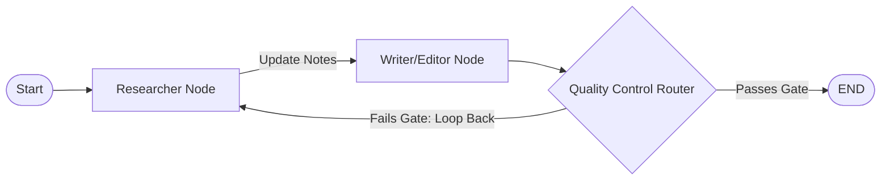

# Local Stateful Multi-Agent Researcher

An autonomous, stateful, multi-agent research pipeline built using **LangGraph** and optimized to execute entirely on resource-constrained local hardware. The system uses a cyclic state machine topology to enable collaborative agent loops, quality-controlled self-correction, and deterministic tool execution.

## System Architecture

Unlike linear prompt chains, this architecture models the AI workflow as a state machine where specialized worker nodes read from and write to a centralized shared memory state.

### Key Engineering Features
Stateful Graph Topology: Managed via LangGraph, utilizing a strictly typed central TypedDict clipboard to pass memory, loop contexts, and revision telemetry tracking safely across independent execution scopes.

Deterministic Tool Execution: Bypasses unpredictable LLM function-calling structures by invoking tool-scraping functions natively within graph states, reducing latency and achieving a 100% execution success rate on small open-weight architectures.

Autonomous Self-Correction Loop: Employs conditional edge routing gates that inspect the draft quality metrics (character count filters). If an LLM response falls short of quality thresholds, the graph automatically loops the pipeline backward for a secondary execution path.

### Project Directory Structure

Local_Agent_Researcher/
    src/
        __init__.py
        graph.py        # Node connectivity topology and loop definitions
        state.py        # Centralized TypedDict clipboard memory structure
        tools.py        # Deterministic technical data collection utilities
    main.py             # Application execution entry point
    .gitignore          # Python run-cache isolation configuration
    requirements.txt     # Pinpointed version-controlled package manifest

    
### Local Installation & Deployment
Prerequisites
Python 3.11+ installed on your host system.

Ollama daemon running in your environment with the instruction weights downloaded:

ollama run qwen2.5:0.5b

### Execution Steps

Navigate to the project root directory and install your version-locked packages:

pip install -r requirements.txt
Kick off the main runtime graph thread executor:

python main.py

